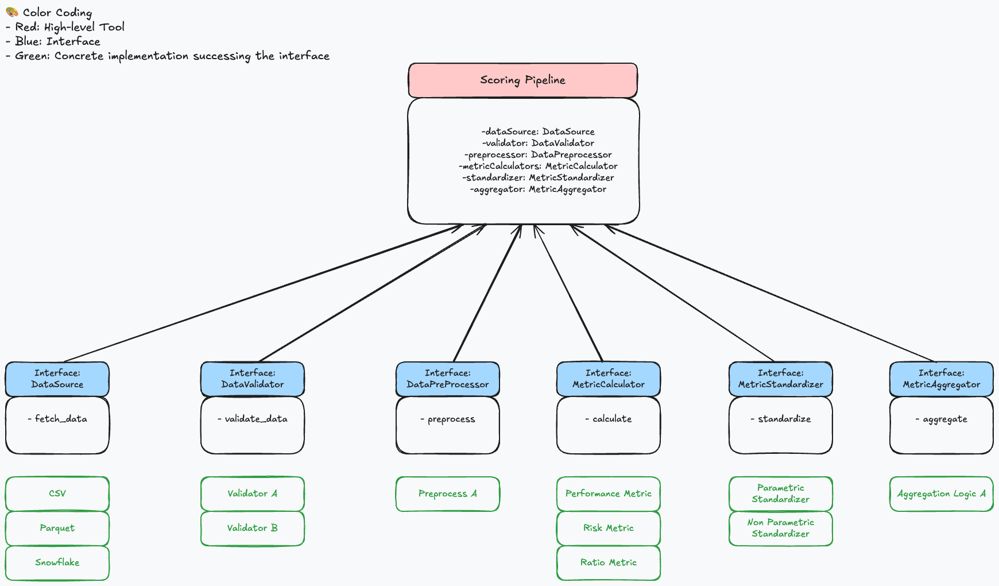

# AlphaRank

## Overview

This Fund Performance Analysis Tool is a Python-based solution designed to evaluate and rank investment strategies based on various performance metrics. It provides a flexible and extensible framework for processing financial data, calculating performance metrics, and generating comprehensive reports.

## Initial Design

I have visualized the initial workflow of the tool in the following diagram:

- Excalidraw: <https://excalidraw.com/#json=v6XVZrcQ1-HYj0gApcJza,aafwbEI8JS1oZZe5UoAj1A>

I have also visualized the initial component design of the tool in the following diagram:


## Features

- Data ingestion from various sources (CSV, Parquet, databases)
- Calculation of key performance metrics (Excess Return, Beta, Sharpe Ratio, etc.)
- Customizable scoring and ranking system
- Standardization of metrics for fair comparison
- Aggregation of multiple metrics into a single score

## Installation

To utilize this library, you will currently need to clone the repository and then install it as a [uv](https://docs.astral.sh/uv/) tool. Follow these steps:

```bash
cd alpharank
uv tool install .
```

## Usage

TBD

## Running Tests

To run the test suite:

```bash
pytest tests/
```

## Extending the Tool

### Adding New Metrics

1. Create a new metric calculator in `src/metrics/calculator`, inheriting from `MetricCalculator`.
2. Implement the `calculate` method for your new metric.
3. Register the new calculator in `src/metrics/calculator/factory.py`.

### Custom Data Sources

1. Implement a new data source class in `src/data/`, inheriting from `DataSource`.
2. Override the `fetch_data` method to handle your specific data source.
